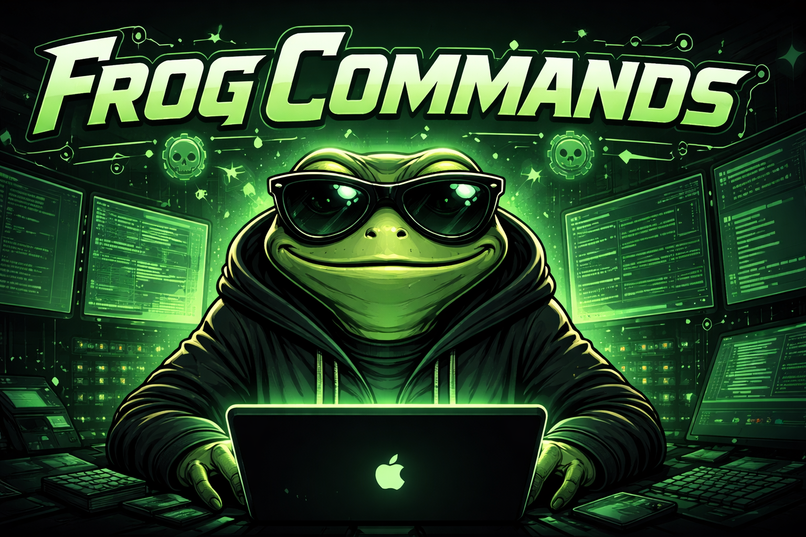

# 🐸 FrogCommands

> Cross-platform toolkit to bootstrap a hacking environment in seconds...



---

## ⚡ About

FrogCommands is a cross-platform toolkit designed to quickly set up a complete security testing environment on **macOS, Linux, and WSL**.

Instead of manually installing and configuring dozens of tools, FrogCommands provides a **simple, reproducible, and automated setup** — so you can focus on what actually matters.

---

## 🚀 Features

- ⚡ One-command installation  
- 🐧 Supports Linux, macOS, and WSL  
- 🧠 Smart OS & package manager detection  
- 📦 Curated pentesting toolkit  
- 🔁 Idempotent (won’t reinstall what already exists)  
- 🔧 Easy to extend and customize  

---

## 🛠 Included Tools

- **Recon / Scanning** → nmap  
- **Fuzzing / Enumeration** → ffuf, gobuster  
- **SQLi** → sqlmap  
- **Bruteforce** → hydra  
- **Hash Cracking** → hashcat, john  
- **Networking / Tunneling** → socat, chisel  
- **Traffic Analysis** → tcpdump, wireshark  
- **HTTP Clients** → curl, httpie  
- **Parsing** → jq  
- **Dev Tools** → node (via nvm)  

---

## 📦 Installation

```bash
git clone https://github.com/yourusername/FrogCommands.git
cd FrogCommands
chmod +x install.sh
./install.sh